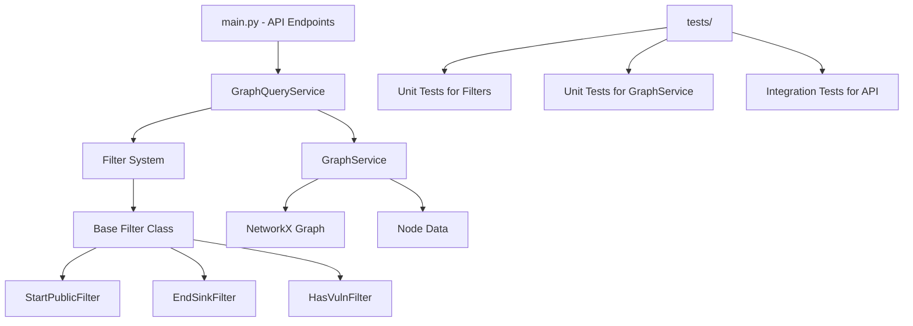

# Backslash/Home-exercise

This project implements a RESTful API for querying a graph of Train Ticket microservices based on the provided JSON data. The API allows filtering routes (paths) in the graph based on specific criteria and returns a graph structure suitable for client-side rendering, including a Mermaid diagram.

## Solution Overview

The application uses Python with FastAPI to create a web API. It loads the `train-ticket.json` file, which represents a directed graph of microservices and their dependencies. The graph is built using NetworkX for efficient path finding and manipulation.

### Key Components

- **Graph Construction**: The JSON data is parsed to create a directed graph where nodes are services/databases and edges represent dependencies (calls).
- **Filtering Logic**: Routes (simple paths) are filtered based on:
  - Starting from public services (`publicExposed: true`)
  - Ending in sinks (nodes with `kind: "rds"` or `"sqs"`)
  - Containing at least one vulnerable node (nodes with `vulnerabilities` array)
- **API Endpoints**:
  - `/graph`: Returns JSON with nodes, edges, and Mermaid diagram of the filtered graph.
  - `/graph/html`: Returns an HTML page with the Mermaid diagram rendered.
- **Generic Design**: Filters are implemented as query parameters, making it easy to add more filters in the future.

### Assumptions

- The graph is directed and may contain cycles, but we use simple paths (acyclic) for routes.
- Sinks are defined as nodes with `kind` in `["rds", "sqs"]`.
- Public services have `publicExposed: true`.
- Vulnerabilities are indicated by the presence of a `vulnerabilities` key in the node data.
- Paths are limited to a cutoff of 10 to prevent excessive computation.
- If no filters are applied, the full graph is returned (though this may be large; in practice, filters should be used).
- Missing nodes referenced in edges (e.g., "assurance-service") are ignored.

### Decisions

- Used NetworkX for graph operations due to its robustness and path-finding algorithms.
- Implemented filters as intersection: paths must match all enabled filters.
- Returned subgraph contains only nodes and edges from matching paths.
- Mermaid diagram is generated for easy visualization.
- Added HTML endpoint for direct viewing.

## Installation

1. Ensure Python 3.8+ is installed.
2. Install dependencies:
   ```
   pip install -r requirements.txt
   ```

## Usage

Run the application:
```
python main.py
```

The API will be available at `http://localhost:8000`.

### API Endpoints

#### GET /graph

Query the filtered graph.

**Query Parameters:**
- `start_public` (bool, default false): Include routes starting from public services.
- `end_sink` (bool, default false): Include routes ending in sinks.
- `has_vuln_filter` (bool, default false): Include routes with at least one vulnerable node.

**Response:**
```json
{
  "nodes": [
    {
      "name": "service-name",
      "kind": "service",
      "language": "java",
      ...
    }
  ],
  "edges": [
    {
      "from": "service-a",
      "to": "service-b"
    }
  ],
  "mermaid": "graph TD\nservice_a[service-a] --> service_b[service-b]\n..."
}
```

#### GET /graph/html

Returns an HTML page with the Mermaid diagram.

**Query Parameters:** Same as `/graph`.

## Architecture

The application follows clean architecture principles with separation of concerns:

- **`graph_service.py`**: Handles graph data loading and basic graph operations
- **`filters.py`**: Implements a modular filter system with a base `Filter` class and specific filter implementations (`StartPublicFilter`, `EndSinkFilter`, `HasVulnFilter`)
- **`graph_query_service.py`**: Orchestrates filtering and graph querying logic
- **`main.py`**: FastAPI application with dependency injection for services

Filters can be easily extended by implementing the `Filter` abstract base class.

### Architecture diagram


## Testing

### Unit Tests
Run unit tests for individual components:
```bash
python -m pytest tests/test_filters.py tests/test_graph_service.py -v
```

### Integration Tests
Run API integration tests (requires the application to be running):
```bash
python -m pytest tests/test_api.py -v
```

### Manual Testing
Use tools like `curl` or a browser to test:

- Full graph: `http://localhost:8000/graph`
- Public to sink: `http://localhost:8000/graph?start_public=true&end_sink=true`
- Vulnerable paths: `http://localhost:8000/graph?has_vuln_filter=true`
- HTML view: `http://localhost:8000/graph/html?start_public=true`

## Future Enhancements

- Add more filters (e.g., by language, path).
- Implement path length limits or pagination for large results.
- Add authentication or rate limiting.
- Optimize for larger graphs.

## Running the application
- Activate the virtual environment: .\.venv\Scripts\activate
- Install the dependencies: python -m pip install -r requirements.txt
- If pydantic-core fails to install due to Rust, install Rust from https://rustup.rs/ and ensure it's in your PATH.
- Run the app: python -m uvicorn main:app --reload