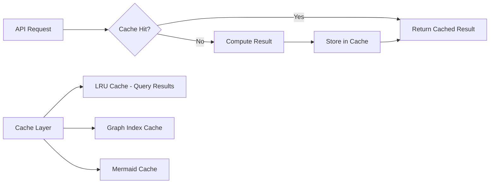
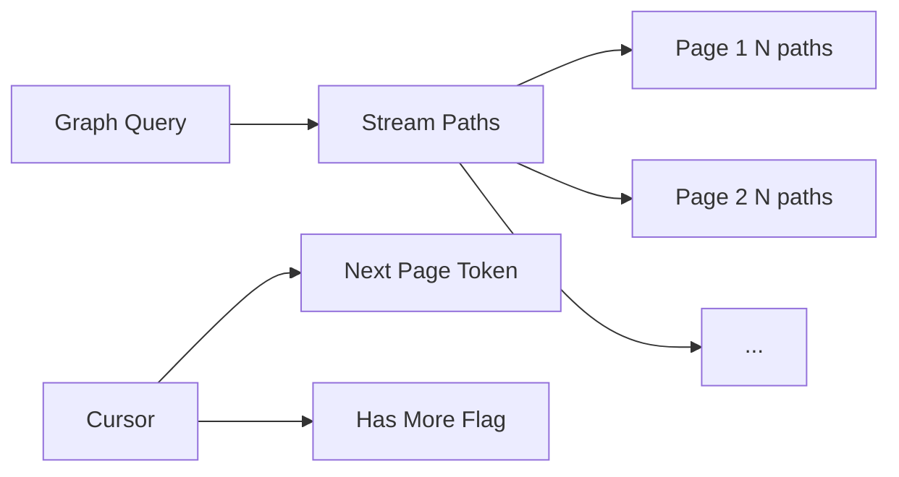
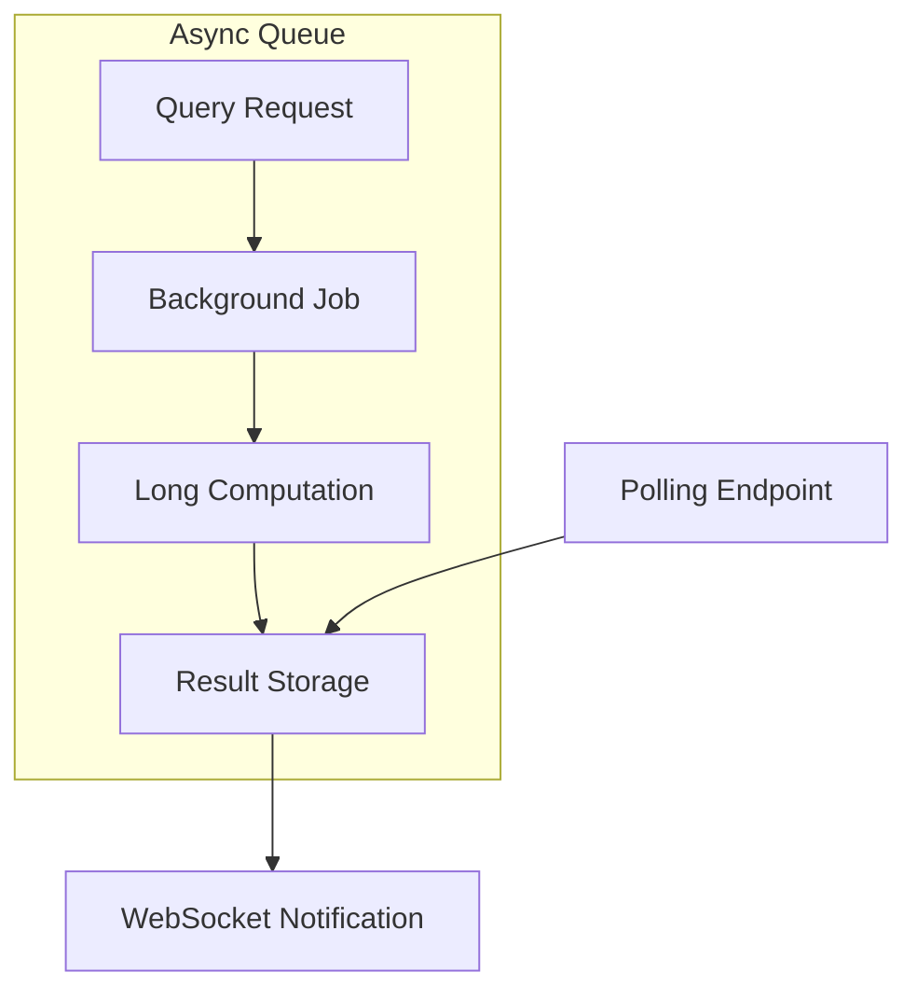
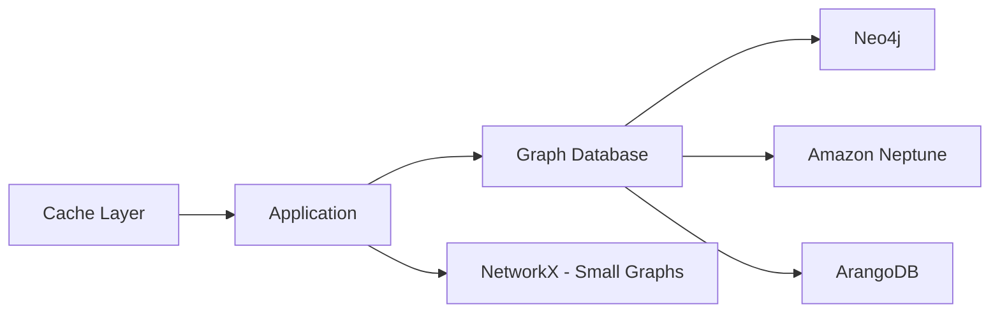

# Performance Optimization Plan for Large Graph Handling

## Executive Summary

This document outlines a comprehensive architecture for handling performance issues when working with very large graphs. The current implementation uses NetworkX for graph operations but has several bottlenecks that scale poorly with graph size.

## Current Bottlenecks Analysis

### Critical Issues

1. **Exponential Path Finding**
   - Location: `graph_query_service.py:24-29`
   - Complexity: O(n² × b^d) where n=nodes, b=branching factor, d=depth
   - Impact: Each start-end pair triggers full path enumeration

2. **No Result Limits**
   - All paths loaded into memory before filtering
   - No pagination or streaming
   - Mermaid diagram built synchronously

3. **No Caching**
   - Repeated queries recompute same results
   - Graph operations not memoized

4. **Monolithic Processing**
   - No async processing
   - No background computation
   - No timeout controls

## Optimization Strategies

### Phase 1: Algorithmic Improvements

#### 1.1 Replace Nested Loop with Targeted Path Finding

**Current Approach:**
```python
for start in all_starts:
    for end in all_ends:
        paths = get_simple_paths(start, end)
```

**Optimized Approach:**
```python
# Build BFS tree from all filtered starts simultaneously
# Only explore paths that can reach filtered ends
```

#### 1.2 Use Bidirectional Search

For large graphs, bidirectional BFS reduces complexity from O(b^d) to O(b^(d/2)).

```python
def get_shortest_paths_optimized(start, end, max_paths=100):
    # Search from both ends simultaneously
    # Return first max_paths results
```

#### 1.3 Implement Early Termination

- Add configurable `max_paths` parameter
- Add `timeout_seconds` parameter
- Return partial results with pagination token

### Phase 2: Caching Strategy



#### 2.1 Query Result Caching
- Use `functools.lru_cache` for deterministic queries
- Cache key: hash of filter parameters
- TTL: configurable per endpoint

#### 2.2 Graph Index Caching
- Pre-compute reachability matrix
- Cache node degrees and centrality metrics
- Store filtered node/edge lists

### Phase 3: Streaming and Pagination



#### 3.1 Path Streaming
```python
async def get_filtered_graph_stream(filters, limit=1000, offset=0):
    # Use generator for lazy evaluation
    # Yield paths in batches
    # Support offset/limit pagination
```

#### 3.2 Result Pagination
- Add `page` and `page_size` parameters
- Include `total_count` and `has_more` in response
- Implement cursor-based pagination for efficiency

### Phase 4: Async Processing



#### 4.1 Background Processing
- Use Celery or asyncio for long-running queries
- Return job ID immediately
- Polling endpoint for status and results

#### 4.2 WebSocket Support
- Push results when ready
- Real-time progress updates

### Phase 5: Graph Database Integration

For very large graphs (>100k nodes), consider:



#### 5.1 Neo4j Integration
```python
# Replace NetworkX with Cypher queries
def get_simple_paths_neo4j(start, end, max_depth=10):
    query = """
    MATCH path = (start:Service {name: $start})-[*1..$max_depth]->(end:Service {name: $end})
    RETURN path
    LIMIT $max_paths
    """
    return neo4j.execute(query)
```

#### 5.2 Hybrid Approach
- Use NetworkX for small graphs (<10k nodes)
- Offload large queries to graph database
- Unified API for both backends

## Implementation Roadmap

### Step 1: Add Limits and Timeouts
- [ ] Add `max_paths` parameter to `get_simple_paths()`
- [ ] Add `timeout_seconds` parameter
- [ ] Implement early termination with partial results

### Step 2: Implement Result Caching
- [ ] Add `@lru_cache` decorator for deterministic queries
- [ ] Cache filtered node/edge lists
- [ ] Add cache invalidation

### Step 3: Streaming API
- [ ] Convert path enumeration to generator
- [ ] Add pagination parameters
- [ ] Implement cursor-based pagination

### Step 4: Optimize Path Finding
- [ ] Replace nested loop with BFS from filtered starts
- [ ] Prune paths that can't reach filtered ends
- [ ] Add bidirectional search option

### Step 5: Async Processing
- [ ] Add background job queue
- [ ] Implement polling endpoint
- [ ] Add WebSocket support

### Step 6: Graph Database Integration (Optional)
- [ ] Create Neo4j backend adapter
- [ ] Implement hybrid routing
- [ ] Add connection pooling

## Code Changes Required

### graph_service.py
```python
class GraphService:
    def get_simple_paths(self, start, end, cutoff=10, max_paths=1000, timeout=None):
        """Get paths with limits and early termination."""
        # Implementation with generator and timeout
        pass
    
    def get_reachable_nodes(self, start, max_depth=10):
        """Get all nodes reachable from start within depth limit."""
        pass
```

### graph_query_service.py
```python
class GraphQueryService:
    def get_filtered_graph(self, filters, max_results=10000, timeout=30, page=1):
        """Get filtered graph with pagination."""
        pass
    
    def get_filtered_graph_stream(self, filters, batch_size=1000):
        """Stream filtered paths as generator."""
        pass
```

### main.py
```python
@app.get("/graph")
def get_graph(start_public: bool = False, end_sink: bool = False, 
              has_vuln_filter: bool = False, max_results: int = 10000,
              timeout: int = 30, page: int = 1):
    """Get filtered graph with limits and pagination."""
    pass

@app.get("/graph/stream")
async def get_graph_stream(start_public: bool = False, end_sink: bool = False,
                          has_vuln_filter: bool = False, batch_size: int = 1000):
    """Stream filtered graph paths."""
    pass

@app.post("/graph/job")
def create_graph_job(start_public: bool = False, end_sink: bool = False,
                    has_vuln_filter: bool = False):
    """Create background job for large graph queries."""
    pass
```

## Performance Metrics to Monitor

| Metric | Current | Target | Measurement |
|--------|---------|--------|-------------|
| Response Time (100 nodes) | ~100ms | <50ms | API latency |
| Response Time (10k nodes) | Timeout | <5s | API latency |
| Memory Usage | O(p) | O(1) | Bytes per query |
| Path Enumeration | Blocking | Streaming | Concurrent requests |

## Estimated Impact

| Optimization | Complexity Improvement | Memory Improvement |
|--------------|----------------------|-------------------|
| Max Paths Limit | N/A | O(n) → O(1) |
| Early Termination | O(b^d) → O(b^(d/2)) | Same |
| Caching | O(1) cache hit | O(n) cached |
| Streaming | Same | O(batch) vs O(n) |

## Conclusion

For handling very large graphs, the recommended approach is:

1. **Immediate**: Add limits, timeouts, and caching
2. **Short-term**: Implement streaming and pagination
3. **Long-term**: Consider graph database for >10k nodes

The key is to avoid exhaustive path enumeration and instead use targeted searches with early termination and result streaming.
